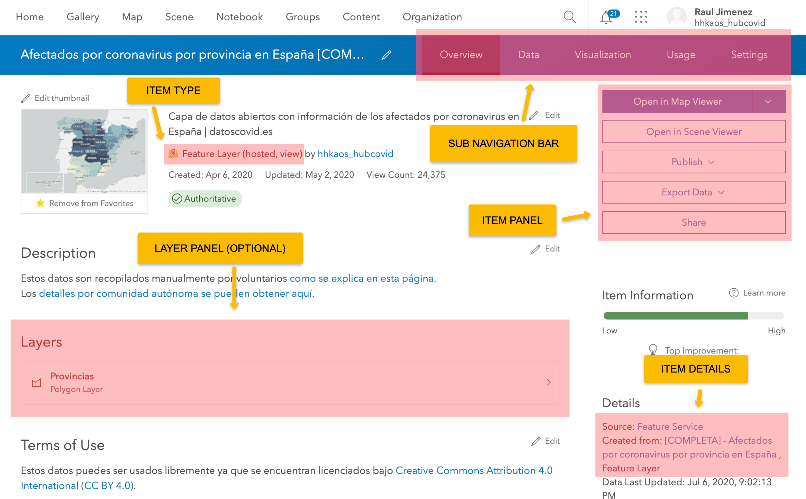
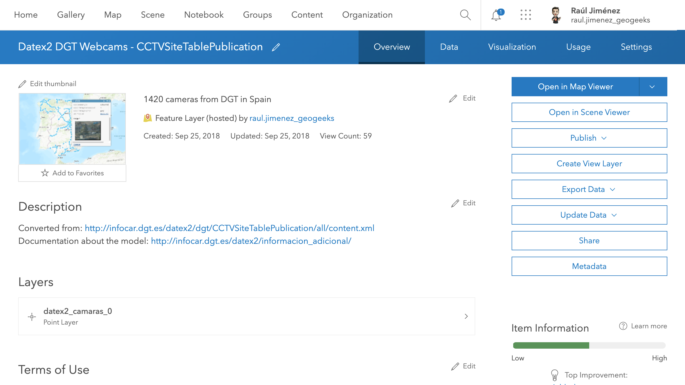
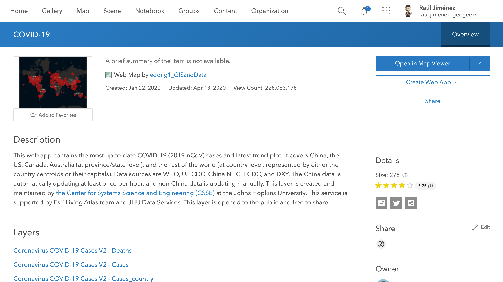
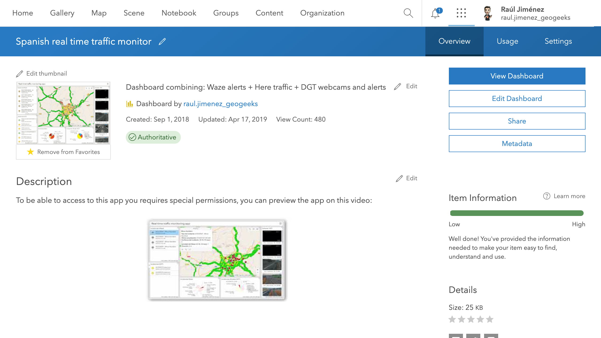

# Item, Item types and search

<!-- START doctoc generated TOC please keep comment here to allow auto update -->
<!-- DON'T EDIT THIS SECTION, INSTEAD RE-RUN doctoc TO UPDATE -->
**Table of Contents** 

- [Summary](#summary)
- [Type keywords](#type-keywords)
- [Item categories](#item-categories)
- [Item details page](#item-details-page)
  - [Structure of a item page](#structure-of-a-item-page)
  - [Different layouts samples](#different-layouts-samples)
- [Advanced search queries](#advanced-search-queries)
- [Type keywords listing](#type-keywords-listing)

<!-- END doctoc generated TOC please keep comment here to allow auto update -->

## Summary

ArcGIS supports +100 item types, and only ArcGIS Online has 1M items. 

[item and item types](https://developers.arcgis.com/rest/users-groups-and-items/items-and-item-types.htm) plays a key role on the ArcGIS GeoInformation Model, and properly understand how they work behind the scene will take you to the next level.

> **Note:** If you are not familiar with which content can be hosted and served in ArcGIS please check: [what can you add to ArcGIS Online?](https://doc.arcgis.com/en/arcgis-online/reference/supported-items.htm) and/or [what types of services can you publish in ArcGIS Enteprise?](https://enterprise.arcgis.com/en/server/latest/publish-services/windows/what-types-of-services-can-you-publish.htm).

## Type keywords

Type keywords are used by Esri as an internal tagging system to provide additional information about the characteristics of that type. 

**For example**: 

* In order to avoid duplicating items while performing a migration between organizations using the [clone_items(..) function of the Python API](https://developers.arcgis.com/python/api-reference/arcgis.gis.toc.html#arcgis.gis.ContentManager.clone_items), the API adds a typekeyword ["source-<itemId>"](https://www.arcgis.com/home/search.html?q=typekeywords%3A%22source-%22&restrict=false) on each item cloned.

* To differenciate a hosted Feature Layer from a hosted Feature Layer view (both have type: "Feature Service") it adds the typekeyword "View Service". This way it also knows it need to use the [relatedItems endpoint](https://developers.arcgis.com/rest/users-groups-and-items/related-items.htm) to find from which item it was created.

* Differenciate types of configurable apps (configurable and self-configurable))

Platform end-users have another property ([tag](https://developers.arcgis.com/rest/users-groups-and-items/common-parameters.htm#ESRI_SECTION1_1FFBA7FE775B4BDA8D97524A6B9F7C98)) to tag content and filter it.

**When are the item types and item keywords defined?**

Unlike the `tag` property, the `typekeyword` property use to be automatically filled by the ArcGIS products and SDKs add them using the [addItem endpoint of the REST](https://developers.arcgis.com/rest/users-groups-and-items/add-item.htm). But it can be also used by developers, but it is important to do it carefully, without abusing.

## Item categories

Items are organized on categories based on their primary use.

Depending on the interface you are using you will find different categories on to filter ([ArcGIS Online search interface](https://www.arcgis.com/home/search.html?q=), [Living Atlas filters](https://livingatlas.arcgis.com/en/browse/#d=2), [Map Viewer > Add layer > Filter](https://www.arcgis.com/apps/mapviewer/index.html), [ArcGIS Hub Search](https://hub.arcgis.com/search?q=), [ArcGIS Pro > Search portal items](https://pro.arcgis.com/en/pro-app/latest/help/projects/search-portal-items.htm), ...):

|Item category|Web context|Map context
|---|---|---|
|Maps|Web Maps|Map packages and map documents
|Layers|Variety of geospatial content services|Layer packages|
|Styles|n.a.|Desktop styles
|Tools|Variety of geospatial task services|Geoprocessing and locator packages
|Applications|Variety of web and mobile mapping apps|Add-ins and other extensions
|Data files|Content that can be published to create geospatial services|Variety of files that can be shared via the portal
|...|...|...|

 

> **Note:** There is no documentation about how to these categories works behind the scenes. But playing with this knowledge you check for example how the [ArcGIS Online Search filter for Experience Builder Apps](https://www.arcgis.com/home/search.html?q=&focus=applications-experience) match the [items with type:"Web Experience"](https://www.arcgis.com/home/search.html?q=type%3A%22Web%20Experience%22) + [items with type:"Web Experience Template"](https://www.arcgis.com/home/search.html?q=type%3A%22Web%20Experience%20Template%22) or just [items with typekeywords:"Web Experience"](https://www.arcgis.com/home/search.html?q=typekeywords%3A%22Web%20Experience%22).

## Item details page

One of the implications item and item types have are its implications while rendering the layout. 

Based on the item type and if you have permissions on it, the interface of the item details page (living at: arcgis.com/home/item.html?id=<item_id>) will be rendered differently as we will see.

### Structure of a item page

The [item details page](https://doc.arcgis.com/en/arcgis-online/manage-data/item-details.htm) have a common structure among all items, but based on the item type and typekeywords, it will render some parts differently.

In the following image you can see those parts:

* **Item type**: this display the item type that was loaded. Some of the common types are: 
    * Feature layer ()
    * Imagery layer ()
    * Dashboards ()
    * Configurable apps ()
    * Vector tile layer () 
    * ... [find more](https://doc.arcgis.com/en/arcgis-online/reference/layers.htm)

* **Sub navigation bar**: based on the item type some features will be enabled as we will see. Been the owner of the item will also unblock some features.

* **Item panel**: as the previous navigation bar, this panel will also vary based on the item type + typekeywords and the ownership of the item.

* **Layer panel**: this is a panel that is displayed when a layer is loaded (service layers: feature layers, operational layers, basemaps layers, elevetion layers, ...). It includes addional features to query/manage each layer contained in the service.

* **Item details**: it will show different details based on the item type. For example in a hosted Feature Service it will display any Views were created from it.

### Different layouts samples

Now we are actually going to see how these layouts are different based on what we have just said previously.

---

Layout of an owned **feature layer/service** item:

---

Layout of a owned **hosted feature layer/service view** item:

---

Layout tile **layer/service** item:

---

Layout of a webmap item:

---

Layout of a configurable app **template** item:

---

Layout of a configurable app (**configured** and owned) item:

--- 

Layout of a document link item:

---

Layout of a 360 VR Experience item

## Advanced search queries

As explained in [ArcGIS Online documentation > Use advanced search](https://doc.arcgis.com/en/arcgis-online/reference/advanced-search.htm), type and also typekeywords also can be used to filter content thought the ArcGIS Online interface, but not only there.

But also APIs support some of them:

* **ArcGIS Portal > Search**: [<root-url>/sharing/rest/search](https://developers.arcgis.com/rest/users-groups-and-items/search.htm) support filter by `type` and `typekeywords` ([query sample on ArcGIS Online](https://www.arcgis.com/sharing/rest/search?q=typekeywords:%22Feature%20Service%22&f=json)).

* **Living Atlas** database is organized internally as an ArcGIS Online group owner by the Esri team ([LAW Search](https://www.arcgis.com/home/group.html?id=47dd57c9a59d458c86d3d6b978560088#overview)) so it also support filtering by `type` and `typekeywords` ([query sample to the Living Atlas](https://www.arcgis.com/sharing/rest/content/groups/47dd57c9a59d458c86d3d6b978560088/search?f=json&q=type:%22Feature%20Service%22&categories=/Categories)).

* **ArcGIS Hub v3 API**: [/api/v3/search](https://gist.github.com/hhkaos/ec877e5957170217b8277aca5fa71e31#get-apiv3search) support filter by `types` ([query sample](https://opendata.arcgis.com/api/v3/search?filter[type]=any(Feature%20Service))).

> **Related project**: [ArcGIS Online advanced (items) search](https://esri-es.github.io/arcgis-developer-resources/arcgis-online/search/).

## Type keywords listing

Those are the type keywords you can search for:

360, ArcGIS Mobile Map, Web Map, 3D, 3DObject, Add In, App, App Builder, AppBuilder, Application, ArcGIS, ArcGIS for Android, ArcGIS for iPhone, ArcGIS Image Server, ArcGIS Mobile, ArcGIS Online, ArcGIS Operation View, ArcGIS Operations Dashboard, ArcGIS Pro, ArcGIS Server, Business Analyst, CAD, Catalog, City, Code Sample, Collector, Color Set, Compare, Configurable, Configuration, Connection, Content Category Set, CSV, Cube Map, Dashboard, Data, Data Store, Database, Desktop, Document, PDF, Experience, Explorer, Explorer Web Map, Extension, Feature Access, Feature Action, Feature Collection, Feature Service, Feature Service Template, File, Flex, Form, Geocoding Service, Geodata Service, Geodatabase, Geoenrichment, Geometry Service, Geoprocessing Service, Globe Service, Hosted Service, HTML3D/HTML, Hub, Image, Image Service, Insights Model, Insights Page, Insights Workbook, Installer, IntegratedMesh, iPhone, JavaScript, Job Tracking, JTX, KML, KML Collection, Locator, Locator Service, Mac, Map, Map Area, Map File, Map Notes Template, Map Service, Mapping Site, mapx, Microsoft Excel, Microsoft Powerpoint, Microsoft Word, Mobile, Mobile Application, Native, Native Application Template, Network Analysis Service, Offline, OGC, Online Map, OpenData, Operations Dashboard, Ortho, Ortho Maker, Ortho Mapping Project, Ortho Mapping Template, Orthomosaic, Orthophoto, Panorama, Photo, Point, PointCloud, Proposals, Ready To Use, Relational, Report Template, Route Layer, Scenarios, Scene, Scene Service, Service, Service Definition, Shapefile, Silverlight, Smart Cities, Spherical, SQLite Geodatabase, Statistical Data Collection, Streaming, Street View, Survey123, Symbol Set, Template, Text, Tool, Vector Tile Service, Virtual Reality, Visio Document, VR, VR360, Web, Web ADF, Web Feature Service, Web Map, Web Map Service, Web Map Tile Service, Web Scene, Web Tool, Widget, Windows Mobile, WMServer, Workflow, Workflow Manager, Workforce Project, xForm, ...

Check them all the information about them in the [item and item types documentation page](https://developers.arcgis.com/rest/users-groups-and-items/items-and-item-types.htm)
